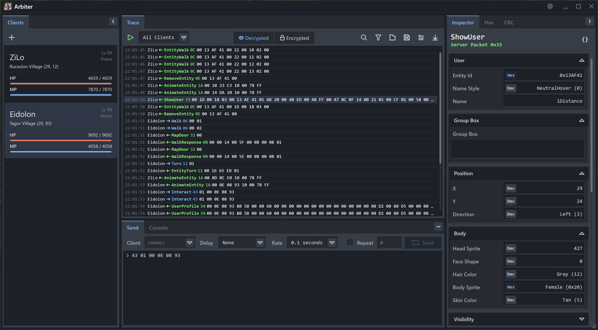

# Arbiter

Network Analyzer Tool for Dark Ages

Written in .NET + [Avalonia](https://docs.avaloniaui.net/docs/welcome), using [MVVM](https://learn.microsoft.com/en-us/dotnet/communitytoolkit/mvvm/) patterns.
Custom UI styling based on [Godot's](https://godotengine.org/) UI look and feel.

> [!WARNING]
> This project is in early development!  
> Some features may not work as expected or are subject to change.

---



## Requirements ✅

- [Dark Ages](https://www.darkages.com) Client 7.41 (current latest)
- [.NET 9.0 Runtime](https://dotnet.microsoft.com/en-us/download/dotnet/9.0)
- Windows, macOS*, Linux*

> [!NOTE]
> Launching a game client is only supported on Windows, as it uses Win32 APIs.  
> You can still analyze network packet dumps or redirect clients from other platforms or VMs.

## Installation 💾

1. Download the [latest release](https://github.com/ewrogers/Arbiter/releases/)
2. Extract all files to `C:\Arbiter` (or your choosing)
3. Open `Arbiter.exe`
4. Configure your DA installation path in `Settings` (if different)

## Usage 📜

### Launching a Game Client

Click on the `+` button in the top-left corner to launch a game client.
It will automatically be redirected to Arbiter running locally on your machine.

### Starting a Trace

Click on the ▶️ button within the `Trace` tab to begin capturing packets.
All packets from all clients will be captured and displayed in the `Trace` tab.

You can filter the packets by clicking on the `Filter` button in

### Saving / Loading Traces

Click on the `Save` button to save the current trace to a file.
You can also right-click on selected packets to save them individually.

Click on the `Load` button to load a trace from a file.
You can also hold down `Shift` while clicking `Load` to append the trace to the current one.

### Sending Raw Packets

You can send both client and server packets by using the `Send` window.
By default, all packets will be assumed to be client packets (meaning they are sent to the server as if the client sent them).

You can override this by prefixing the packet with `<` to indicate a server packet or `>` to indicate a client packet:

```
> 43 03 00 0A 00 08 01      // this is a client packet
< 32 00                     // this is a server packet
```

Each packet should be placed on its own line in the text box area and in the following format:

```
[COMMAND] [DATA...]
```

For example:

```
43 03 00 0A 00 08 01        // click on tile 10, 8
```

Packets that you copy from traces using the right-click menu will be in the correct format already.
**However**, you should ensure it is prefixed with the right direction (client or server) before sending it.

You can also select the initial delay before sending begins, as well as the delay (rate) between each packet.

### Inspecting Packets

When selecting a packet, the `Inspector` tab will display information about the packet in a structured format.
Sections can be collapsed by clicking on the arrow next to the section title.

You can also right-click on a field to copy its value to the clipboard.
If you wish to copy the entire structured object as JSON, you can click on the `Copy JSON` button on the top-right.

### Raw Hex View

You can view the decrypted packet payload in the `Hex` tab on the right-side panel.
By selecting a range of bytes you can visualize various values in different formats.

## Documentation 📚

TBD

## Roadmap 📌

### v1.0

- [x] Character View
  - [x] Name
  - [x] Level + Class
  - [x] HP / MP
  - [x] Map Location
- [x] Inspector Tooltips
- [x] Find by Command (Next/Prev)
- [x] Delete Trace Packets
- [x] Save/Load Traces
- [ ] Raw Packet Injection
  - [x] To Client
  - [x] To Server
- [ ] Revamp Settings UI

### v1.1

- [ ] Filter Rules
    - [ ] Simple Conditions
    - [ ] Lua Scripting
- [ ] Trigger Rules
    - [ ] Simple Conditions
    - [ ] Lua Scripting

### v1.2

- [ ] Custom Scripts

## Contributing 👨🏻‍💻

Contributions are welcomed for this project! Please open an issue or pull request if you have any suggestions, fixes, or improvements.

I personally use JetBrains Rider for development, but any editor should work as long as you install the appropriate Avalonia plugins.

## Packaging 📦

To package and deploy the application binary as a single-file executable, use the following command:

```powershell
cd Arbiter.App
dotnet publish -r win-x64 -c Release -p:PublishSingleFile=true --self-contained false
```

You can use the platform of your choice, but the `win-x64` target is recommended.

> [!IMPORTANT]
> You must include the published `.dll` files with the executable.

## Attribution 🙏🏻

Special thanks to [Chaos Server](https://github.com/Sichii/Chaos-Server) and [Hybrasyl](https://github.com/hybrasyl/server) repositories for many of the packet structures.
